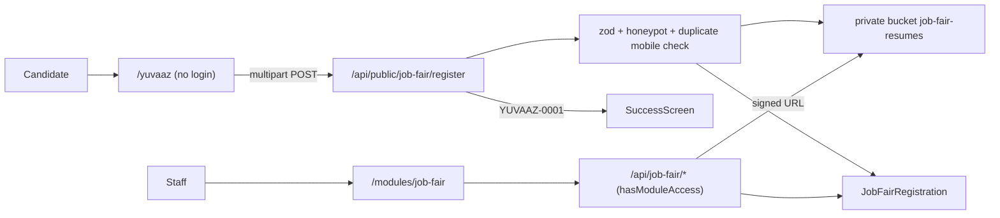

# YUVAAZ 2026 Job Fair Registration

## Flow

## 1. Database and storage (additive migration)

New file `supabase/migrations/20261001120000_job_fair_registration.sql`:
- `CREATE SEQUENCE IF NOT EXISTS job_fair_registration_seq`.
- `CREATE TABLE IF NOT EXISTS "public"."JobFairRegistration"` with these columns: `id uuid`, `event_code` (default `'yuvaaz-2026'`), `registration_no` (unique, e.g. `YUVAAZ-0001`), `full_name`, `mobile`, `whatsapp`, `age smallint` (with CHECK 14-70), `gender`, `area`, `area_other`, `pincode` (CHECK 6 digits), `epic_number`, `qualification`, `course`, `employment_status`, `experience`, `job_types text[]`, `job_type_other`, `heard_from`, `resume_storage_path`, `resume_file_name`, `resume_size_kb`, `status` (default `'registered'`, so staff can later mark attendance), `created_at`, `updated_at`.
- The value lists are enforced with CHECK constraints.
- `UNIQUE (event_code, mobile)` enforces the duplicate block. Add indexes on `created_at DESC`, `area`, and `qualification`, then `ENABLE ROW LEVEL SECURITY`. The service role is the only writer.
- Create a private bucket with `INSERT INTO storage.buckets ('job-fair-resumes', ..., public=false, file_size_limit 5MB) ON CONFLICT DO NOTHING`, following [supabase/migrations/20260820114455_app_file_storage_buckets.sql](supabase/migrations/20260820114455_app_file_storage_buckets.sql).
- Grant the `job-fair` module to the `admin` role with an upsert into `RoleModulePermissions`, as in [supabase/migrations/20260703120000_adm_module.sql](supabase/migrations/20260703120000_adm_module.sql).
- Nothing is dropped or deleted.

## 2. Shared config and validation

- `lib/job-fair/options.ts` holds the event metadata: title, tagline, date, time, venue, and MLA credit. It also holds every option list from the brief: the areas (including "Other – Please Specify"), qualifications, employment statuses, experience bands, job types, and sources. The form, the API, and the admin filters all import from this one file.
- `lib/job-fair/schema.ts` is a zod schema shared by the client and the server:
  - Mobile and WhatsApp must be Indian 10-digit numbers matching `/^[6-9]\d{9}$/`. Spaces and a `+91` prefix are stripped first.
  - Age must be a number from 14 to 70, and the PIN code must be exactly 6 digits.
  - `area_other` is required when the area is Other, and `job_type_other` is required when the job type includes Other.
  - At least one job type must be selected.
  - The EPIC number is optional, normalized with the existing [lib/epic/normalize-epic](lib/epic/normalize-epic.ts).
- Resume uploads accept PDF, DOC, DOCX, JPG, or PNG files up to 5 MB.

## 3. Public API

`app/api/public/job-fair/register/route.ts` (POST, multipart):
1. Parse the form data and reject the request if the hidden `website` honeypot field is filled.
2. Validate with the zod schema.
3. Pre-check for a duplicate mobile number. If one exists, return `409 { registrationNo }` so the UI can show "You are already registered".
4. Insert the row. The registration number comes from `'YUVAAZ-' || lpad(nextval(...)::text, 4, '0')`. A unique-violation race also maps to 409.
5. If there is a resume, upload it to `job-fair-resumes/yuvaaz-2026/<id>/<sanitized-name>` using `supabase.storage` and `sanitizeStorageObjectKey`, then update `resume_storage_path`. If the upload fails, the registration is kept and the response returns `resumeUploaded: false`.

Add `/yuvaaz` and `/api/public/` to the public allowlist in [middleware.ts](middleware.ts), next to the existing `/s/` rule.

DB queries go in `lib/db/job-fair-queries.ts` and use `sql` from [lib/db/postgres.ts](lib/db/postgres.ts).

## 4. Public page UI/UX (`app/yuvaaz/page.tsx` and `components/job-fair/registration-form.tsx`)

**Hero banner:**
- Branded gradient band with the "YUVAAZ 2026" wordmark, the tagline "PROTEST BHI. PROGRESS BHI. AB JOB KI BAARI!!", and the "An initiative by Sana Malik Shaikh, MLA Anushakti Nagar" credit.
- Uses the logo from `public/images/landing/logo.png`.
- Three info chips (date, time, and venue) with lucide icons. The venue chip links to Google Maps.

**Wizard card:**
- The card is `max-w-2xl`, centered, and full width on mobile.
- A sticky progress bar shows "Step 2 of 4" plus step labels. The labels are hidden on small screens with `hidden sm:inline`.
- Step 1, Personal: name, mobile, WhatsApp with a "Same as mobile" checkbox that copies and locks the value, age, and gender. Gender uses large tap-target radio tiles rather than a dropdown.
- Step 2, Address: area combobox (searchable, using the existing [components/ui/combobox.tsx](components/ui/combobox.tsx)), a conditional "Other" field that animates in, PIN code, and an optional EPIC number.
- Step 3, Education and Work: qualification select, course field with a placeholder example, employment status as radio tiles, and an experience select.
- Step 4, Preferences: job types as a multi-select chip grid (`grid-cols-1 sm:grid-cols-2`), a conditional "Other" field, a drag-and-drop or tap resume picker with file name, size, and a remove button, and the "How did you hear" select.
- Review step: a summary of all answers with an "Edit" link per section, then Submit.

**Field behavior:**
- Numeric fields use `inputMode="numeric"`, `maxLength`, and autocomplete attributes such as `tel` and `name`.
- Validation runs per step when the user presses Next, with inline errors that scroll and focus the first invalid field.
- Draft answers are saved to `localStorage` so a page refresh does not lose data. The draft is cleared on success.
- The Next and Back buttons sit at the bottom of the card. They are `w-full sm:w-auto` and `h-11`, and stay sticky on mobile.

**Result screens:**
- Success: a check animation (framer-motion, already a dependency), the registration number in large type, event details, and an "Add to calendar" `.ics` download. A "Share on WhatsApp" link uses `wa.me` with text inviting friends to `/yuvaaz`. A note asks the candidate to bring their resume and ID.
- Duplicate: friendly screen showing the existing registration number.

Errors are shown with `sonner` toasts. Metadata (title and OG description) is set for nicer WhatsApp link previews. The page is checked at 390, 768, and 1280px.

## 5. Internal module `job-fair`

- Register the module in [lib/module-constants.ts](lib/module-constants.ts) with key `job-fair`, label "Job Fair", icon `Briefcase`, category `operations`, and default role `admin`. Add it to `MODULE_DISPLAY_ORDER` and `MODULE_KEYS`.
- `app/modules/job-fair/page.tsx` uses the same auth and `hasModuleAccess` guard as [app/modules/adm/page.tsx](app/modules/adm/page.tsx).
- `components/job-fair/job-fair-module.tsx` contains:
  - Stat cards: total registrations, today (IST), with resume, and top areas.
  - A search box (name, mobile, or registration number) and filters for area, qualification, experience, job type, and date range (IST days), using the responsive filter grid.
  - A table from `md:` up and stacked cards on mobile, paginated. A row opens a detail dialog with a "View resume" button.
  - An "Export CSV" button.
  - A "Copy public link" button for `/yuvaaz`.
- APIs, each guarded by `hasModuleAccess(..., 'job-fair')`:
  - `app/api/job-fair/registrations/route.ts`: GET, paginated and filtered.
  - `app/api/job-fair/registrations/[id]/resume/route.ts`: GET, returns a short-lived signed URL from `createSignedUrl`.
  - `app/api/job-fair/registrations/export/route.ts`: GET, streams CSV.
- All timestamps are shown with `formatDisplayDateTimeIST` from `@/lib/ist-date`.

## 6. Verify

- Run `npx next lint`.
- Submit end to end against local Supabase, both with and without a resume.
- Confirm a duplicate mobile number returns the existing registration number.
- Open the module as an admin and check the resume signed URL and CSV export.
